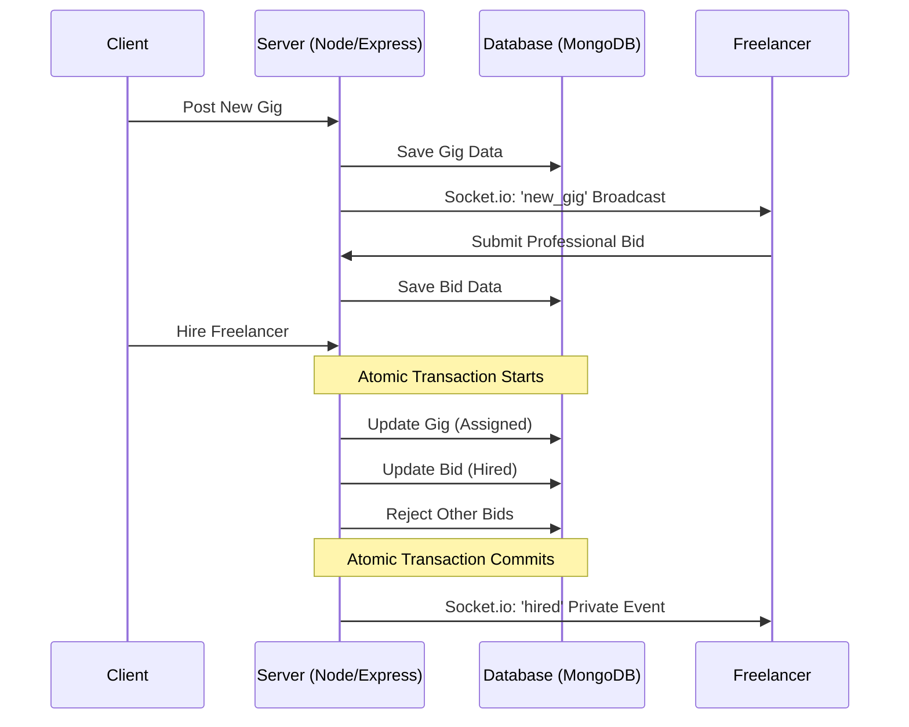

# 🚀 GigFlow: Premium Freelance Marketplace

<div align="center">


**A high-performance, real-time freelance marketplace built for the modern web.**

[](https://mongodb.com)
[](https://socket.io)
[](https://opensource.org/licenses/MIT)
[](https://github.com/Annu881/GigFlow/pulls)

[Explore Docs](https://github.com/Annu881/GigFlow#api-documentation) · [Report Bug](https://github.com/Annu881/GigFlow/issues) · [Request Feature](https://github.com/Annu881/GigFlow/issues)

</div>

---

## 📑 Table of Contents
- [🎯 Overview](#-overview)
- [✨ Features](#-features)
- [🏗️ Architecture](#-architecture)
- [🛠️ Tech Stack](#-tech-stack)
- [📸 Visual Overview](#-visual-overview)
- [🚀 Getting Started](#-getting-started)
- [📊 API Documentation](#-api-documentation)
- [🔒 Security](#-security)
- [🤝 Contributing](#-contributing)
- [📄 License](#-license)

---

## 🎯 Overview
GigFlow is a sophisticated freelance marketplace platform that bridges the gap between talented freelancers and visionary clients. Unlike traditional platforms, GigFlow leverages **Real-time WebSockets** and **Atomic Database Transactions** to provide a seamless, race-condition-free experience.

### Key Highlights:
- **Real-time Ecosystem**: Instant notifications for bids, hiring, and new opportunities.
- **Transactional Integrity**: Robust hiring logic that ensures data consistency.
- **Premium UI**: Modern glassmorphism design with smooth, fluid animations.
- **Dual Roles**: Seamlessly switch between being a Client and a Freelancer.

---

## ✨ Features

### 🛠️ For Clients (Project Owners)
- **🚀 Rapid Posting**: Create detailed gigs with categories, budgets, and descriptions in seconds.
- **📈 Bid Analytics**: Review and manage all freelancer proposals from a unified dashboard.
- **⚡ One-Click Hire**: Atomic hiring process that automatically rejects other bids and notifies the winner.
- **🗑️ Gig Management**: Full control over your listings, including the ability to delete or update.

### 💼 For Freelancers
- **🔍 Smart Discovery**: Find the perfect project using real-time search and category-based filtering.
- **📝 Professional Bidding**: Submit high-impact proposals with custom pricing and messages.
- **🔔 Instant Alerts**: Receive real-time "🎉 Hired" notifications the moment you're selected.
- **📊 Bid Tracking**: A dedicated dashboard to monitor the status of all your active applications.

---

## 🏗️ Architecture

### System Workflow
The following diagram illustrates the real-time interaction between Clients and Freelancers within the GigFlow ecosystem.



---

## 🛠️ Tech Stack

### Frontend
- **React 18**: Component-based UI with Vite for lightning-fast builds.
- **Redux Toolkit**: Centralized state management for predictable data flow.
- **Tailwind CSS**: Modern, responsive styling with custom glassmorphism utilities.
- **Socket.io-client**: Real-time event handling.

### Backend
- **Node.js & Express**: Scalable and modular RESTful API architecture.
- **MongoDB & Mongoose**: NoSQL database with complex relationship handling.
- **Socket.io**: Global event emission and private room management.
- **JWT & Bcrypt**: Industry-standard security for authentication and password hashing.

---

## 📸 Visual Overview

### 🖥️ Project Demo
**[Watch the Full Walkthrough Video](https://drive.google.com/file/d/1oEtK5ehhGbLvIwj4b6tKwk95sfg9NUak/view?usp=sharing)**

### 🖼️ Screenshots
| Dashboard View | Gig Details & Bidding |
| :---: | :---: |
|  |  |

---

## 🚀 Getting Started

### 1. Clone & Install
```bash
git clone https://github.com/Annu881/GigFlow.git
cd gigflow
```

### 2. Backend Setup
```bash
cd backend
npm install
```
Create a `.env` file:
```env
MONGO_URI=your_mongodb_uri
JWT_SECRET=your_jwt_secret
PORT=5000
CLIENT_URL=http://localhost:5173
```
> [!TIP]
> The backend features **Automated Port Recovery**. If port 5000 is occupied, it will automatically clear it before starting!

### 3. Frontend Setup
```bash
cd ../frontend
npm install
```
Create a `.env` file:
```env
VITE_API_URL=http://localhost:5000
VITE_SOCKET_URL=http://localhost:5000
```

---

## 📊 API Documentation

### 🔑 Authentication
| Method | Endpoint | Description |
| :--- | :--- | :--- |
| POST | `/api/auth/register` | Register a new user |
| POST | `/api/auth/login` | Authenticate & get token |
| GET | `/api/auth/me` | Get current user profile |

### 💼 Gigs
| Method | Endpoint | Description |
| :--- | :--- | :--- |
| GET | `/api/gigs` | Fetch all open gigs |
| POST | `/api/gigs` | Create a new gig |
| DELETE | `/api/gigs/:id` | Remove a posted gig |

### 📝 Bids
| Method | Endpoint | Description |
| :--- | :--- | :--- |
| POST | `/api/bids` | Submit a proposal |
| PATCH | `/api/bids/:id/hire` | Hire a freelancer |

---

## 🔒 Security
- **Secure Cookies**: JWTs are stored in `HttpOnly` cookies to prevent XSS.
- **Input Sanitization**: All user inputs are validated and sanitized.
- **Protected Routes**: Middleware-level authorization for all sensitive actions.

---

## 🤝 Contributing
Contributions are what make the open-source community such an amazing place to learn, inspire, and create.

1. Fork the Project
2. Create your Feature Branch (`git checkout -b feature/AmazingFeature`)
3. Commit your Changes (`git commit -m 'Add some AmazingFeature'`)
4. Push to the Branch (`git push origin feature/AmazingFeature`)
5. Open a Pull Request

---

## 📄 License
Distributed under the MIT License. See `LICENSE` for more information.

---

**Developed with ❤️ by [Annu Rana](https://github.com/Annu881)**
